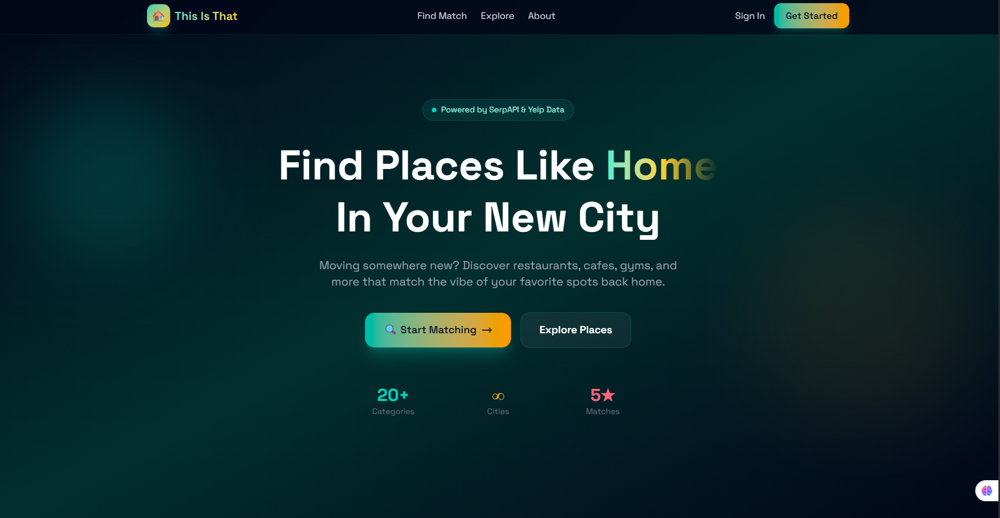
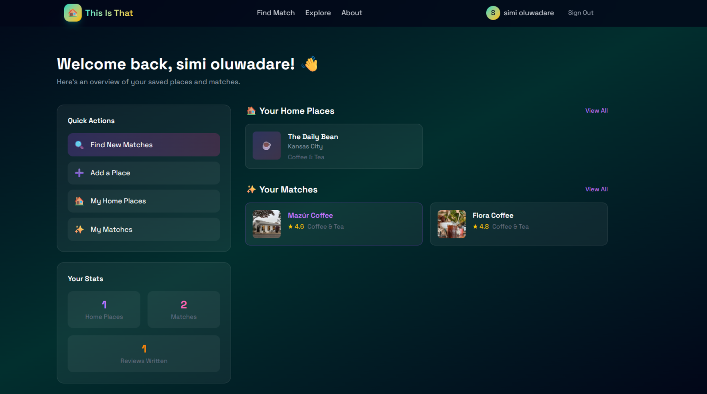
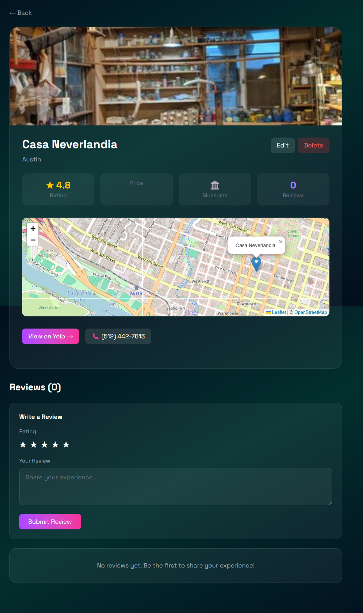

# This Is That - City Matching App 🌍



"This Is That" is a Rails application that helps digital nomads and travelers find familiar places in new cities. Love **Blue Bottle Coffee** in **San Francisco**? We'll help you find the equivalent vibe in **Tokyo**, **Austin**, or **Berlin**.

## ✨ Features

- **Smart Matching**: Connects you to places that feel like home.
- **Yelp Integration**: Real-time data on ratings, prices, and reviews.
- **Visual Search**: Beautiful UI to explore your matches.
- **Save Favorites**: Keep track of the spots you want to visit.
- **User Accounts**: Personalized experience with profile management.

## 🚀 Getting Started

### Prerequisites

- Ruby 3.2+
- Rails 7.1+
- PostgreSQL
- Bundler

### Installation

1. **Clone the repository**
   ```bash
   git clone https://github.com/yourusername/this_is_that.git
   cd this_is_that
   ```

2. **Install dependencies**
   ```bash
   bundle install
   ```

3. **Setup Database**
   ```bash
   rails db:create db:migrate
   ```

4. **Environment Variables**
   Create a `.env` file and add your API keys:
   ```
   SERPAPI_KEY=your_key_here
   ```

5. **Start the Server**
   ```bash
   bin/dev
   ```

   Visit `http://localhost:3000` to start searching!

## 📸 The Flow

### 1. Homepage
Start your journey by defining what you're looking for.


### 2. User Dashboard
Manage your profile, view your saved matches, and explore new cities.



### 3. Place Details & Map
See ratings, reviews, and the exact location on our integrated map.



## 🛠 Tech Stack

- **Backend**: Ruby on Rails 7
- **Frontend**: TailwindCSS, Hotwire (Turbo & Stimulus)
- **Database**: PostgreSQL
- **APIs**: SerpAPI (Yelp Data)
- **deployment**: Render / Heroku (Ready)

## 🤝 Contributing

1. Fork the project
2. Create your feature branch (`git checkout -b feature/AmazingFeature`)
3. Commit your changes (`git commit -m 'Add some AmazingFeature'`)
4. Push to the branch (`git push origin feature/AmazingFeature`)
5. Open a Pull Request

## 📄 License

Distributed under the MIT License. See `LICENSE` for more information.
